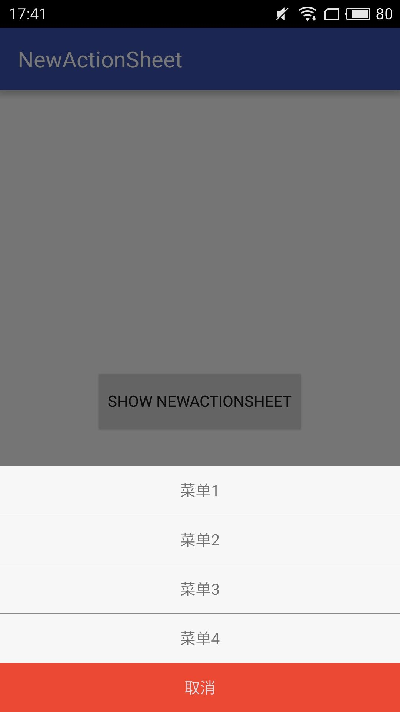

# NewActionSheet
this is a Android style UIActionSheet

###Example

We can use it like this:

	NewActionSheet as = new NewActionSheet(this);
    as.addItems(ITEMS);
    as.setItemClickListener(this);
    as.setCancelableOnTouchMenuOutside(true);
    as.showMenu();

### Build in Android Studio
Via Gradle:

`compile 'pz.library.newactionsheet:actionsheetlibrary:1.0.0'`

